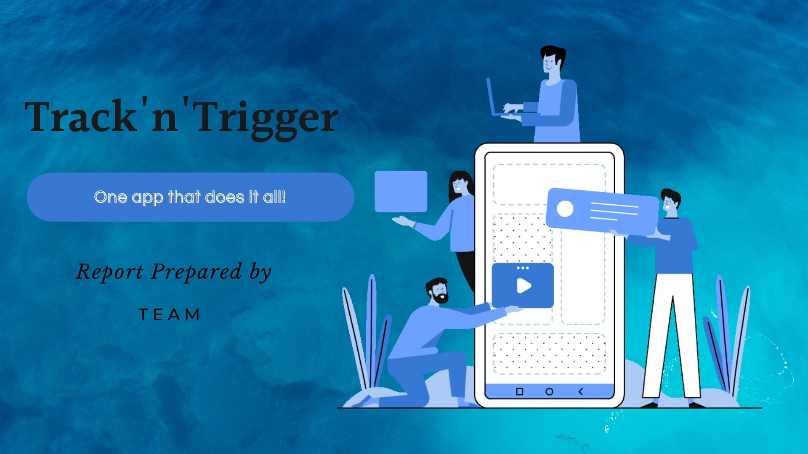
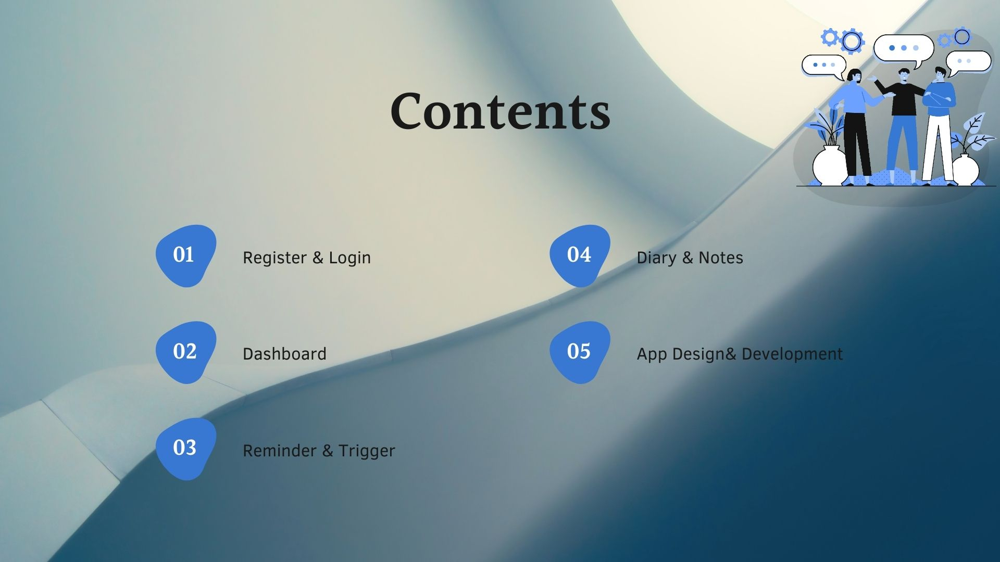
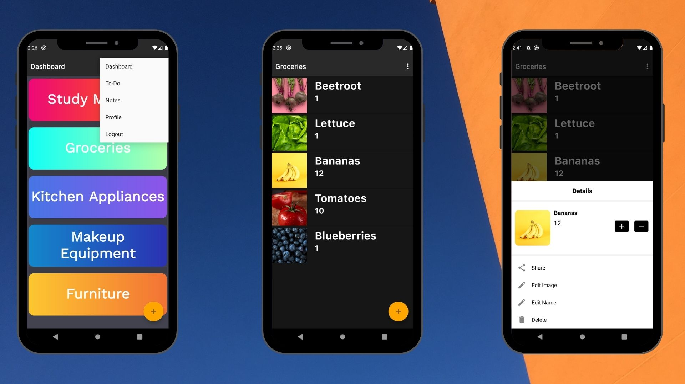
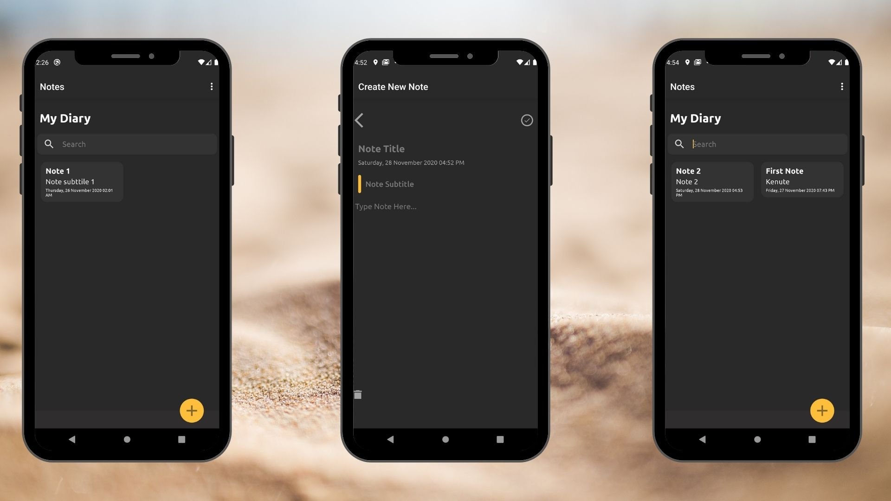
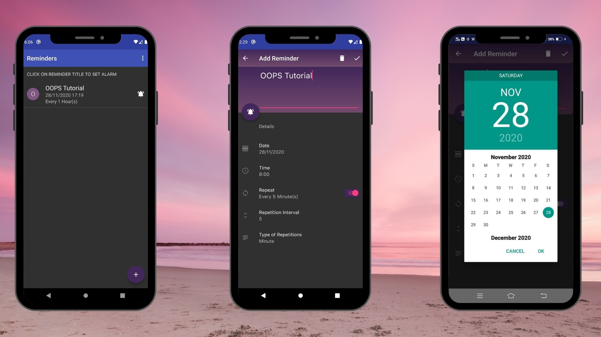

Min SDK version - 16

Target SDK version - 30

Android Gradle Plugin version 4. 1. 0

Gradle Version 6. 5

Compile SDK 30

App was developed on Android Studio :

One app for all your needs with

Material Design & State Of Art UI

Secure Signup

Features:
Reliable and
User Friendly
Keep Track with
Push Notifications
Reminder & Notes

Interactive Dashboard
for easy Navigation
Built to last with
Google's power

Contents

01 Register & Login

02 Dashboard

03 Reminder & Trigger
04 Diary & Notes
05 App Design& Development

App Design
FRONTEND : JAVA
BACKEND : FIREBASE (REALTIME DATABSE) &

SQL DATABASE
'Tracker'
User can add new category in
dashboard as well as any number
of materials under each category
depending on their lifestyle
'Trigger'
If there are any meetings or TO-DO
activity scheduled, then the application
sends a PUSH Notification.
User can maintain a personal diary.
'Share'
User can share the image and other
details of any material or appliance
which is available in their dashboard
with any of their friends, relatives and
colleagues through Gmail or
WhatsApp.
'Learning Outcomes'

Sharing image along with text
through Gmail and WhatsApp.
Creating customised dashboards
with attractive colours.
Notify through Gmail.

Credits :
Stackoverflow

Firebase Docs

Youtube Tutorials

Pinterest

Github

Developers Android
